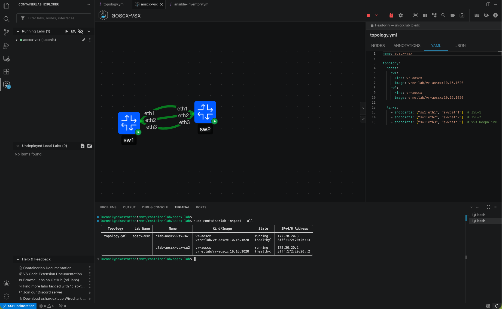
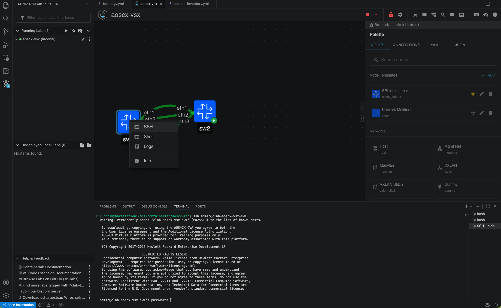
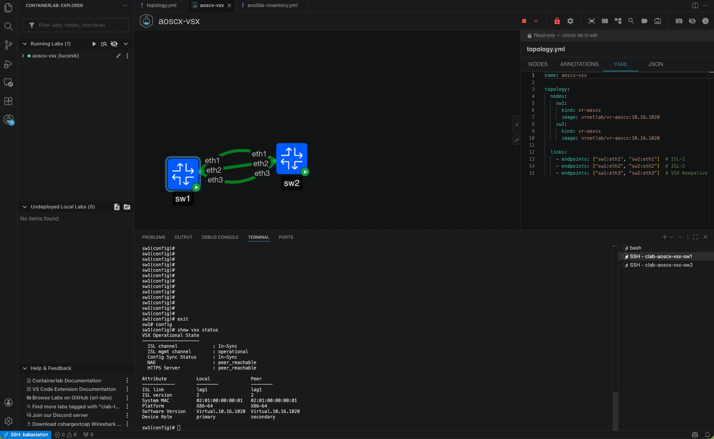
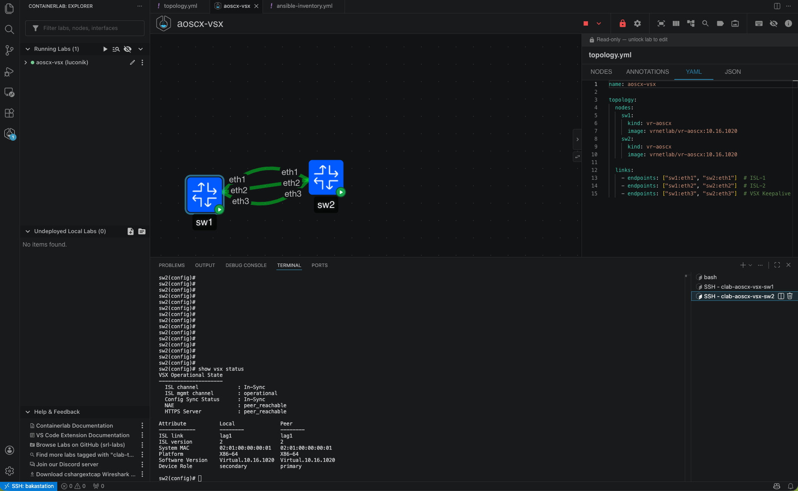
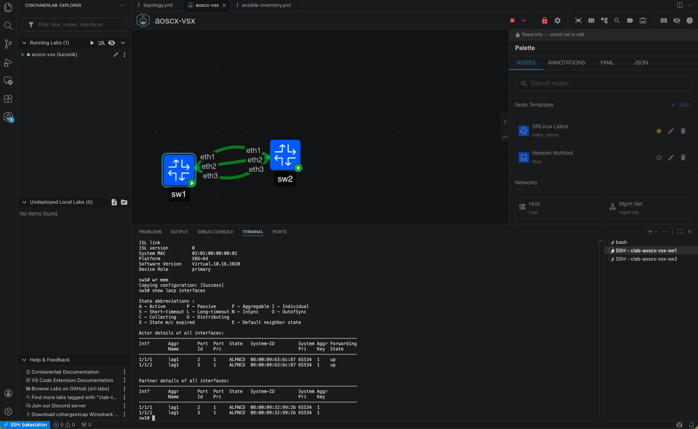
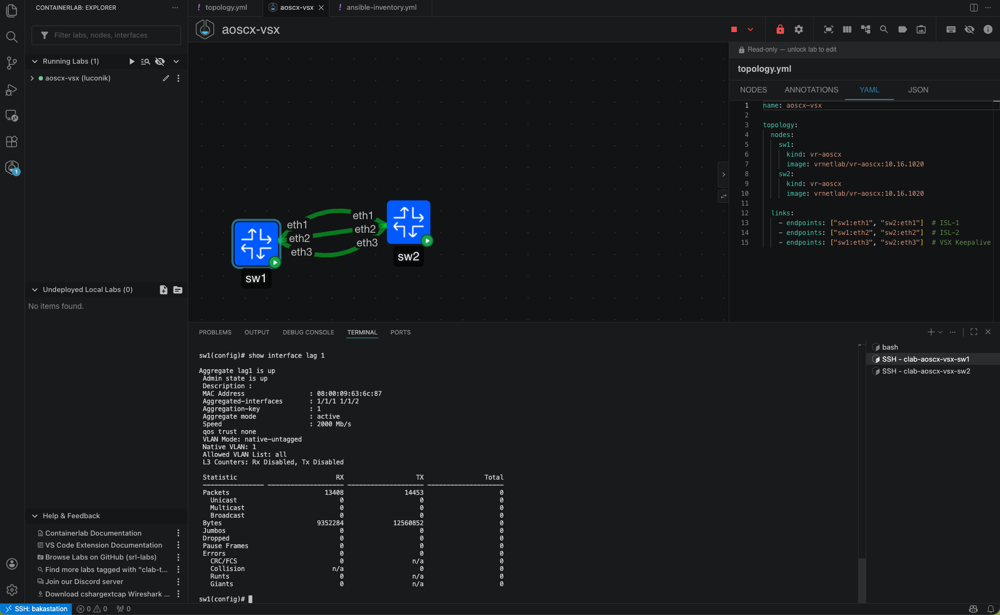

# Containerlab — AOS-CX VSX Lab

> 🇫🇷 Français | 🇬🇧 [English](#containerlab--aos-cx-vsx-lab-en)

---

## 🇫🇷 Français

### Description

Ce lab démontre comment utiliser [Containerlab](https://containerlab.dev) pour simuler une paire de switches HPE Aruba AOS-CX en configuration **VSX (Virtual Switching Extension)** — la technologie d'agrégation multi-châssis d'Aruba. L'objectif est de fournir un environnement reproductible pour découvrir Containerlab avec des équipements Aruba, sans matériel physique.

### Prérequis

- Linux (testé sur Fedora 43 et Ubuntu 24.04)
- [Containerlab](https://containerlab.dev/install/) ≥ 0.74
- Docker
- Image vrnetlab AOS-CX : `vrnetlab/vr-aoscx:10.16.1020`
- (Optionnel) Extension VS Code **Containerlab** by srl-labs

### Obtenir l'image AOS-CX

L'image AOS-CX Simulator est disponible gratuitement sur le portail HPE Networking (compte requis).

> 📖 **Guide de création de compte** : [github.com/Luconik/hpe-aruba-guides/tree/main/nsp-account](https://github.com/Luconik/hpe-aruba-guides/tree/main/nsp-account)

Une fois connecté sur [networking.hpe.com](https://networking.hpe.com) :
1. Software → AOS-CX Switch Simulator
2. Télécharger `AOS-CX_10_16_1020.ova`
3. Extraire le `.vmdk` depuis l'OVA : `tar xf AOS-CX_10_16_1020.ova`
4. Builder l'image Docker via vrnetlab :

```bash
git clone https://github.com/srl-labs/vrnetlab
cp AOS-CX_10_16_1020.vmdk vrnetlab/aruba/
cd vrnetlab/aruba
make
# Résultat : vrnetlab/vr-aoscx:10.16.1020
```

### Architecture du lab

```
┌─────────────────────────────────────────────┐
│                 aoscx-vsx                   │
│                                             │
│  ┌──────────┐  eth1/eth2   ┌──────────┐    │
│  │   sw1    │◄────ISL─────►│   sw2    │    │
│  │ primary  │  (LAG LACP)  │secondary │    │
│  │          │◄──keepalive─►│          │    │
│  └──────────┘    eth3      └──────────┘    │
└─────────────────────────────────────────────┘
```

| Lien | Interfaces | Rôle |
|------|-----------|------|
| ISL-1 | sw1:eth1 ↔ sw2:eth1 | Inter-Switch Link (LAG) |
| ISL-2 | sw1:eth2 ↔ sw2:eth2 | Inter-Switch Link (LAG) |
| Keepalive | sw1:eth3 ↔ sw2:eth3 | VSX Keepalive |

### Déploiement

```bash
git clone https://github.com/Luconik/netdevops.git
cd netdevops/containerlab/aoscx-vsx

sudo containerlab deploy -t topology.yml
sudo containerlab inspect --all
```

Les switches sont accessibles en SSH une fois en état `healthy` (~2-3 minutes) :

```bash
ssh admin@172.20.20.3   # sw1
ssh admin@172.20.20.2   # sw2
# Credentials : admin/admin
```

### Plugin VS Code Containerlab

L'extension **Containerlab** (srl-labs) pour VS Code offre une interface graphique pour gérer les labs directement depuis l'éditeur :

- Visualisation de la topologie en temps réel
- Deploy / Destroy / Inspect sans quitter VS Code
- Accès SSH direct par **clic droit** sur un node
- Édition du `topology.yml` avec autocomplétion
- Compatible avec VS Code Remote SSH (accès depuis Mac/Windows vers Linux)

Installation : Extensions → rechercher `Containerlab` → publisher `srl-labs`


*Lab déployé — 2 switches healthy avec leurs IPs*


*Accès SSH direct depuis le plugin VS Code*

### Configuration VSX

#### SW1 (Primary)

```
configure terminal

interface lag 1
  no shutdown
  no routing
  vlan trunk allowed all
  lacp mode active

interface 1/1/1
  no shutdown
  lag 1

interface 1/1/2
  no shutdown
  lag 1

interface 1/1/3
  no shutdown
  ip address 192.168.255.0/31

vsx
  system-mac 02:01:00:00:00:01
  inter-switch-link lag 1
  role primary
  keepalive peer 192.168.255.1 source 192.168.255.0
```

#### SW2 (Secondary)

```
configure terminal

interface lag 1
  no shutdown
  no routing
  vlan trunk allowed all
  lacp mode active

interface 1/1/1
  no shutdown
  lag 1

interface 1/1/2
  no shutdown
  lag 1

interface 1/1/3
  no shutdown
  ip address 192.168.255.1/31

vsx
  system-mac 02:01:00:00:00:01
  inter-switch-link lag 1
  role secondary
  keepalive peer 192.168.255.0 source 192.168.255.1
```

> ⚠️ **Important** : L'interface LAG doit avoir `no routing` **avant** d'être configurée comme `inter-switch-link`.

### Validation

```bash
# Sur sw1 et sw2
show vsx status
show lacp interfaces
show interface lag 1
```

Résultat attendu sur `show vsx status` :

```
ISL channel          : In-Sync
ISL mgmt channel     : operational
Config Sync Status   : In-Sync
NAE                  : peer_reachable
```


*SW1 — VSX established, rôle primary*


*SW2 — VSX established, rôle secondary*


*LACP — interfaces 1/1/1 et 1/1/2 en état ALFNCD (Active, Forwarding, Collecting, Distributing)*


*LAG 1 — Aggregate up, 2000 Mb/s (2x1G LACP)*

### Destruction du lab

```bash
sudo containerlab destroy -t topology.yml --cleanup
```

### Structure du repo

```
containerlab/aoscx-vsx/
├── topology.yml          # Définition du lab
├── sw1-config.txt        # Running-config sw1
├── sw2-config.txt        # Running-config sw2
├── captures/             # Screenshots de validation
└── README.md             # Ce fichier
```

### Known Issues / Tips

- AOS-CX vrnetlab images take ~2-3 minutes to boot — wait for `healthy` state before SSH
- The ISL LAG interface **must** have `no routing` before being configured as inter-switch-link
- Default credentials: `admin/admin`
- Tested with Containerlab 0.74.3 and AOS-CX 10.16.1020

---

## 🇬🇧 English {#containerlab--aos-cx-vsx-lab-en}

### Description

This lab demonstrates how to use [Containerlab](https://containerlab.dev) to simulate a pair of HPE Aruba AOS-CX switches in a **VSX (Virtual Switching Extension)** configuration — Aruba's multi-chassis aggregation technology. The goal is to provide a reproducible environment for discovering Containerlab with Aruba equipment, without physical hardware.

### Prerequisites

- Linux (tested on Fedora 43 and Ubuntu 24.04)
- [Containerlab](https://containerlab.dev/install/) ≥ 0.74
- Docker
- vrnetlab AOS-CX image: `vrnetlab/vr-aoscx:10.16.1020`
- (Optional) VS Code extension **Containerlab** by srl-labs

### Getting the AOS-CX Image

The AOS-CX Switch Simulator image is available for free on the HPE Networking portal (account required).

> 📖 **Account creation guide**: [github.com/Luconik/hpe-aruba-guides/tree/main/nsp-account](https://github.com/Luconik/hpe-aruba-guides/tree/main/nsp-account)

Once logged in at [networking.hpe.com](https://networking.hpe.com):
1. Software → AOS-CX Switch Simulator
2. Download `AOS-CX_10_16_1020.ova`
3. Extract the `.vmdk` from the OVA: `tar xf AOS-CX_10_16_1020.ova`
4. Build the Docker image via vrnetlab:

```bash
git clone https://github.com/srl-labs/vrnetlab
cp AOS-CX_10_16_1020.vmdk vrnetlab/aruba/
cd vrnetlab/aruba
make
# Result: vrnetlab/vr-aoscx:10.16.1020
```

### Lab Architecture

```
┌─────────────────────────────────────────────┐
│                 aoscx-vsx                   │
│                                             │
│  ┌──────────┐  eth1/eth2   ┌──────────┐    │
│  │   sw1    │◄────ISL─────►│   sw2    │    │
│  │ primary  │  (LAG LACP)  │secondary │    │
│  │          │◄──keepalive─►│          │    │
│  └──────────┘    eth3      └──────────┘    │
└─────────────────────────────────────────────┘
```

| Link | Interfaces | Role |
|------|-----------|------|
| ISL-1 | sw1:eth1 ↔ sw2:eth1 | Inter-Switch Link (LAG) |
| ISL-2 | sw1:eth2 ↔ sw2:eth2 | Inter-Switch Link (LAG) |
| Keepalive | sw1:eth3 ↔ sw2:eth3 | VSX Keepalive |

### Deployment

```bash
git clone https://github.com/Luconik/netdevops.git
cd netdevops/containerlab/aoscx-vsx

sudo containerlab deploy -t topology.yml
sudo containerlab inspect --all
```

Switches are accessible via SSH once in `healthy` state (~2-3 minutes):

```bash
ssh admin@172.20.20.3   # sw1
ssh admin@172.20.20.2   # sw2
# Credentials: admin/admin
```

### VS Code Containerlab Extension

The **Containerlab** extension (srl-labs) for VS Code provides a GUI to manage labs directly from the editor:

- Real-time topology visualization
- Deploy / Destroy / Inspect without leaving VS Code
- Direct SSH access via **right-click** on a node
- `topology.yml` editing with autocompletion
- Compatible with VS Code Remote SSH (access from Mac/Windows to Linux)

Install: Extensions → search `Containerlab` → publisher `srl-labs`


*Deployed lab — 2 healthy switches with IPs*


*Direct SSH access from the VS Code plugin*

### VSX Configuration

#### SW1 (Primary)

```
configure terminal

interface lag 1
  no shutdown
  no routing
  vlan trunk allowed all
  lacp mode active

interface 1/1/1
  no shutdown
  lag 1

interface 1/1/2
  no shutdown
  lag 1

interface 1/1/3
  no shutdown
  ip address 192.168.255.0/31

vsx
  system-mac 02:01:00:00:00:01
  inter-switch-link lag 1
  role primary
  keepalive peer 192.168.255.1 source 192.168.255.0
```

#### SW2 (Secondary)

```
configure terminal

interface lag 1
  no shutdown
  no routing
  vlan trunk allowed all
  lacp mode active

interface 1/1/1
  no shutdown
  lag 1

interface 1/1/2
  no shutdown
  lag 1

interface 1/1/3
  no shutdown
  ip address 192.168.255.1/31

vsx
  system-mac 02:01:00:00:00:01
  inter-switch-link lag 1
  role secondary
  keepalive peer 192.168.255.0 source 192.168.255.1
```

> ⚠️ **Important**: The LAG interface **must** have `no routing` **before** being configured as `inter-switch-link`.

### Validation

```bash
# On both sw1 and sw2
show vsx status
show lacp interfaces
show interface lag 1
```

Expected output on `show vsx status`:

```
ISL channel          : In-Sync
ISL mgmt channel     : operational
Config Sync Status   : In-Sync
NAE                  : peer_reachable
```


*SW1 — VSX established, primary role*


*SW2 — VSX established, secondary role*


*LACP — interfaces 1/1/1 and 1/1/2 in ALFNCD state (Active, Forwarding, Collecting, Distributing)*


*LAG 1 — Aggregate up, 2000 Mb/s (2x1G LACP)*

### Lab Teardown

```bash
sudo containerlab destroy -t topology.yml --cleanup
```

### Repo Structure

```
containerlab/aoscx-vsx/
├── topology.yml          # Lab definition
├── sw1-config.txt        # sw1 running-config
├── sw2-config.txt        # sw2 running-config
├── captures/             # Validation screenshots
└── README.md             # This file
```

### Known Issues / Tips

- AOS-CX vrnetlab images take ~2-3 minutes to boot — wait for `healthy` state before SSH
- The ISL LAG interface **must** have `no routing` before being configured as inter-switch-link
- Default credentials: `admin/admin`
- Tested with Containerlab 0.74.3 and AOS-CX 10.16.1020

---

*Lab by [Nicolas Culetto](https://linkedin.com/in/nicolasculetto) — [github.com/Luconik](https://github.com/Luconik)*
