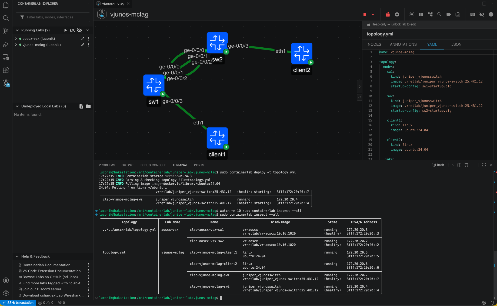
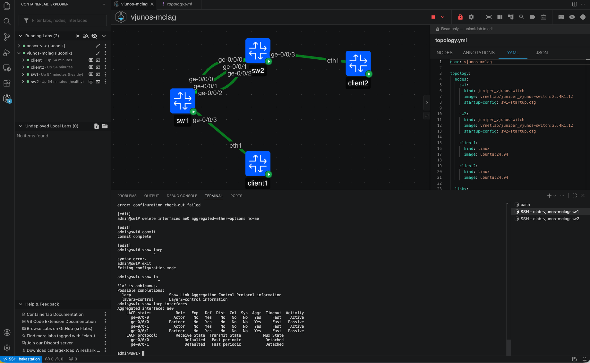
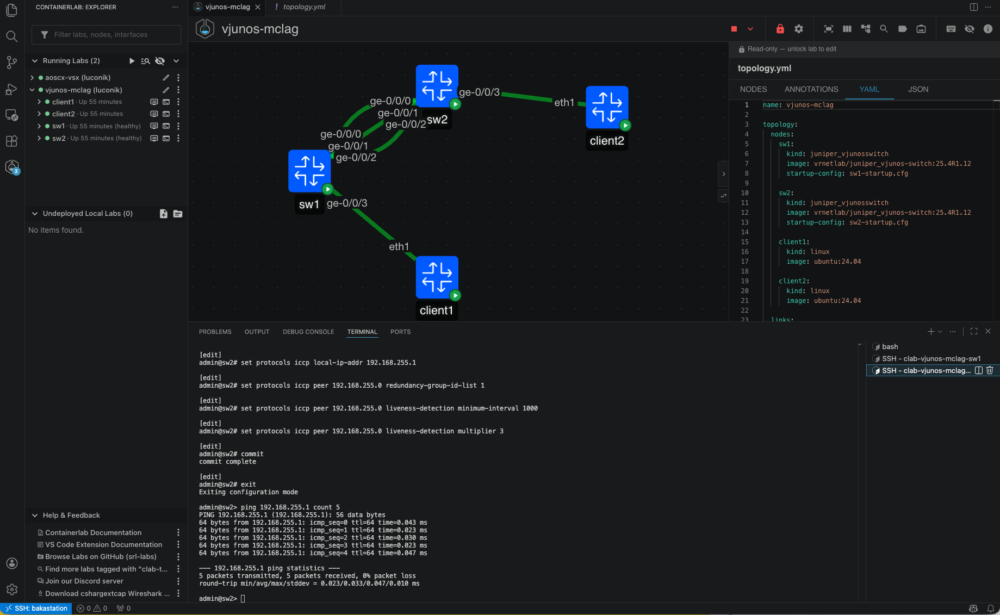
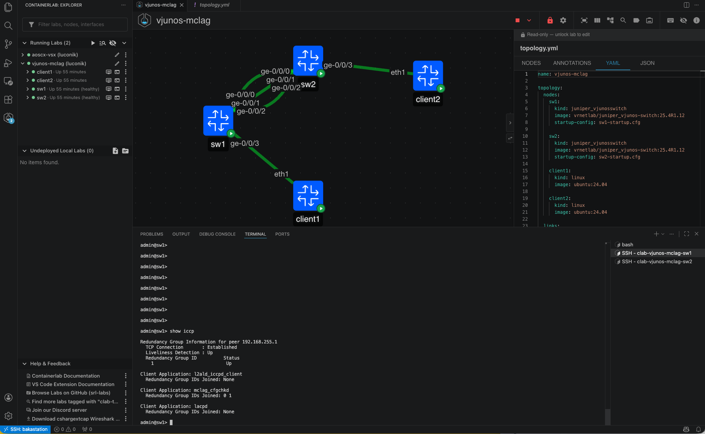

# Containerlab — Juniper vJunos-switch MC-LAG Lab

> 🇫🇷 Français | 🇬🇧 [English](#containerlab--juniper-vjunos-switch-mc-lag-lab-en)

---

## 🇫🇷 Français

### Description

Ce lab démontre comment utiliser [Containerlab](https://containerlab.dev) pour simuler une paire de switches **Juniper vJunos-switch** en configuration **MC-LAG (Multi-Chassis LAG)** avec ICCP (Inter-Chassis Control Protocol). Il constitue le pendant Juniper du [lab AOS-CX VSX](../aoscx-vsx/README.md) et permet de comparer les deux approches d'agrégation multi-châssis HPE Networking.

> ⚠️ **Note** : La configuration MC-AE complète (mc-ae, redondance active/standby) nécessite du matériel physique ou EVE-NG. Ce lab Containerlab couvre l'ICL LACP et l'ICCP keepalive — base de la stack MC-LAG.

### Prérequis

- Linux bare metal (testé sur Fedora 43) — **pas de VM** (nested virtualization requis)
- [Containerlab](https://containerlab.dev/install/) ≥ 0.74
- Docker
- Image vJunos-switch buildée via vrnetlab : `vrnetlab/juniper_vjunos-switch:25.4R1.12`
- (Optionnel) Extension VS Code **Containerlab** by srl-labs

### Obtenir l'image vJunos-switch

L'image est disponible **gratuitement sans compte** sur le portail Juniper :

1. Télécharger `vJunos-switch-25.4R1.12.qcow2` sur [juniper.net/us/en/dm/vjunos-labs.html](https://www.juniper.net/us/en/dm/vjunos-labs.html)
2. Builder l'image Docker via vrnetlab :

```bash
git clone https://github.com/srl-labs/vrnetlab
cp vJunos-switch-25.4R1.12.qcow2 vrnetlab/juniper/vjunosswitch/
cd vrnetlab/juniper/vjunosswitch
make
# Résultat : vrnetlab/juniper_vjunos-switch:25.4R1.12 (~9GB)
```

### Architecture du lab

```
┌──────────────────────────────────────────────────────┐
│                    vjunos-mclag                      │
│                                                      │
│  ┌──────────┐  ge-0/0/0+1   ┌──────────┐           │
│  │   sw1    │◄──ICL LACP───►│   sw2    │           │
│  │          │  (ae0 LACP)   │          │           │
│  │          │◄──ICCP────────►│          │           │
│  └────┬─────┘  ge-0/0/2     └─────┬────┘           │
│       │ge-0/0/3              ge-0/0/3│               │
│  ┌────┴─────┐               ┌──────┴───┐            │
│  │ client1  │               │ client2  │            │
│  │ ubuntu   │               │ ubuntu   │            │
│  └──────────┘               └──────────┘            │
└──────────────────────────────────────────────────────┘
```

| Lien | Interfaces | Rôle |
|------|-----------|------|
| ICL-1 | sw1:ge-0/0/0 ↔ sw2:ge-0/0/0 | Inter-Chassis Link (LAG ae0) |
| ICL-2 | sw1:ge-0/0/1 ↔ sw2:ge-0/0/1 | Inter-Chassis Link (LAG ae0) |
| ICCP | sw1:ge-0/0/2 ↔ sw2:ge-0/0/2 | Keepalive 192.168.255.0/31 |
| Client1 | sw1:ge-0/0/3 ↔ client1:eth1 | Ubuntu test client |
| Client2 | sw2:ge-0/0/3 ↔ client2:eth1 | Ubuntu test client |

### Déploiement

```bash
git clone https://github.com/Luconik/netdevops.git
cd netdevops/containerlab/vjunos-mclag

sudo containerlab deploy -t topology.yml
sudo containerlab inspect --all
```


*Lab déployé — 2 switches + 2 clients Ubuntu, topology graphique dans VS Code*

> ⚠️ Les switches vJunos prennent ~10-15 minutes à démarrer. Le statut `healthy` Docker précède le démarrage SSH de plusieurs minutes. Utiliser la console série si SSH ne répond pas :

```bash
docker exec -it clab-vjunos-mclag-sw1 telnet 0 5000
# login: root (sans mot de passe)
# Puis désactiver l'Auto Image Upgrade :
# configure
# delete chassis auto-image-upgrade
# set system services ssh root-login allow
# set system login user admin class super-user
# set system login user admin authentication plain-text-password
# commit
```

Accès SSH une fois les switches prêts :

```bash
ssh admin@172.20.20.7   # sw1 — admin/Lab12345!
ssh admin@172.20.20.4   # sw2 — admin/Lab12345!
```

### Configuration MC-LAG

#### SW1

```
configure

set chassis aggregated-devices ethernet device-count 2

set interfaces ge-0/0/0 ether-options 802.3ad ae0
set interfaces ge-0/0/1 ether-options 802.3ad ae0

set interfaces ae0 aggregated-ether-options lacp active
set interfaces ae0 aggregated-ether-options lacp system-id 00:01:00:00:00:01
set interfaces ae0 aggregated-ether-options lacp admin-key 1
set interfaces ae0 unit 0 family ethernet-switching interface-mode trunk
set interfaces ae0 unit 0 family ethernet-switching vlan members all

set interfaces ge-0/0/2 unit 0 family inet address 192.168.255.0/31

set protocols iccp local-ip-addr 192.168.255.0
set protocols iccp peer 192.168.255.1 redundancy-group-id-list 1
set protocols iccp peer 192.168.255.1 liveness-detection minimum-interval 1000
set protocols iccp peer 192.168.255.1 liveness-detection multiplier 3

commit
```

#### SW2

```
configure

set chassis aggregated-devices ethernet device-count 2

set interfaces ge-0/0/0 ether-options 802.3ad ae0
set interfaces ge-0/0/1 ether-options 802.3ad ae0

set interfaces ae0 aggregated-ether-options lacp active
set interfaces ae0 aggregated-ether-options lacp system-id 00:01:00:00:00:01
set interfaces ae0 aggregated-ether-options lacp admin-key 1
set interfaces ae0 unit 0 family ethernet-switching interface-mode trunk
set interfaces ae0 unit 0 family ethernet-switching vlan members all

set interfaces ge-0/0/2 unit 0 family inet address 192.168.255.1/31

set protocols iccp local-ip-addr 192.168.255.1
set protocols iccp peer 192.168.255.0 redundancy-group-id-list 1
set protocols iccp peer 192.168.255.0 liveness-detection minimum-interval 1000
set protocols iccp peer 192.168.255.0 liveness-detection multiplier 3

commit
```

### Validation

```bash
# ICCP status
show iccp

# LAG LACP
show lacp interfaces

# Ping keepalive sw1 → sw2
ping 192.168.255.1 count 5

# Interfaces
show interfaces terse
```


*LACP — ae0 avec ge-0/0/0 et ge-0/0/1 actifs*


*Ping keepalive 192.168.255.1 — 5/5, 0% loss, ~0.033ms*


*ICCP — TCP Connection Established, Liveness Detection Up, Redundancy Group Up*

### Différences AOS-CX VSX vs Juniper MC-LAG

| Élément | AOS-CX VSX | Juniper MC-LAG |
|---------|-----------|----------------|
| Technologie | VSX | MC-LAG + ICCP |
| ISL/ICL | LAG LACP | ae0 (LAG LACP) |
| Keepalive | IP dédiée | ICCP sur ge-0/0/2 |
| Sync protocol | VSX natif | ICCP |
| Rôles | primary / secondary | active / standby |
| Config | `vsx` stanza | `protocols iccp` + `mc-ae` |
| Vérification | `show vsx status` | `show iccp` |

### Destruction du lab

```bash
sudo containerlab destroy -t topology.yml --cleanup
```

### Structure du repo

```
containerlab/vjunos-mclag/
├── topology.yml          # Définition du lab
├── sw1-startup.cfg       # Config initiale sw1
├── sw2-startup.cfg       # Config initiale sw2
├── sw1-config.txt        # Running-config sw1 (post-validation)
├── sw2-config.txt        # Running-config sw2 (post-validation)
├── captures/             # Screenshots de validation
└── README.md             # Ce fichier
```

### Known Issues / Tips

- vJunos-switch émule un **EX9214** — mc-ae non supporté en virtualisation Containerlab, utiliser EVE-NG pour la config MC-LAG complète
- Message `Auto Image Upgrade` en boucle au démarrage : normal — désactiver avec `delete chassis auto-image-upgrade` + `commit`
- `commit` sur Junos = `wr mem` sur AOS-CX (config active ET persistante en une commande)
- `commit confirmed 5` : rollback automatique après 5 min si non confirmé — très utile en production
- Credentials : `admin/Lab12345!` et `root/Lab12345!`

---

## 🇬🇧 English {#containerlab--juniper-vjunos-switch-mc-lag-lab-en}

### Description

This lab demonstrates how to use [Containerlab](https://containerlab.dev) to simulate a pair of **Juniper vJunos-switch** switches in a **MC-LAG (Multi-Chassis LAG)** configuration with ICCP (Inter-Chassis Control Protocol). It is the Juniper counterpart of the [AOS-CX VSX lab](../aoscx-vsx/README.md) and allows comparing both HPE Networking multi-chassis aggregation approaches.

> ⚠️ **Note**: Full MC-AE configuration (mc-ae, active/standby redundancy) requires physical hardware or EVE-NG. This Containerlab lab covers ICL LACP and ICCP keepalive — the foundation of the MC-LAG stack.

### Prerequisites

- Linux bare metal (tested on Fedora 43) — **no VM** (nested virtualization required)
- [Containerlab](https://containerlab.dev/install/) ≥ 0.74
- Docker
- vJunos-switch image built via vrnetlab: `vrnetlab/juniper_vjunos-switch:25.4R1.12`
- (Optional) VS Code **Containerlab** extension by srl-labs

### Getting the vJunos-switch Image

The image is available **for free without an account** on the Juniper portal:

1. Download `vJunos-switch-25.4R1.12.qcow2` from [juniper.net/us/en/dm/vjunos-labs.html](https://www.juniper.net/us/en/dm/vjunos-labs.html)
2. Build the Docker image via vrnetlab:

```bash
git clone https://github.com/srl-labs/vrnetlab
cp vJunos-switch-25.4R1.12.qcow2 vrnetlab/juniper/vjunosswitch/
cd vrnetlab/juniper/vjunosswitch
make
# Result: vrnetlab/juniper_vjunos-switch:25.4R1.12 (~9GB)
```

### Lab Architecture

```
┌──────────────────────────────────────────────────────┐
│                    vjunos-mclag                      │
│                                                      │
│  ┌──────────┐  ge-0/0/0+1   ┌──────────┐           │
│  │   sw1    │◄──ICL LACP───►│   sw2    │           │
│  │          │  (ae0 LACP)   │          │           │
│  │          │◄──ICCP────────►│          │           │
│  └────┬─────┘  ge-0/0/2     └─────┬────┘           │
│       │ge-0/0/3              ge-0/0/3│               │
│  ┌────┴─────┐               ┌──────┴───┐            │
│  │ client1  │               │ client2  │            │
│  │ ubuntu   │               │ ubuntu   │            │
│  └──────────┘               └──────────┘            │
└──────────────────────────────────────────────────────┘
```

| Link | Interfaces | Role |
|------|-----------|------|
| ICL-1 | sw1:ge-0/0/0 ↔ sw2:ge-0/0/0 | Inter-Chassis Link (LAG ae0) |
| ICL-2 | sw1:ge-0/0/1 ↔ sw2:ge-0/0/1 | Inter-Chassis Link (LAG ae0) |
| ICCP | sw1:ge-0/0/2 ↔ sw2:ge-0/0/2 | Keepalive 192.168.255.0/31 |
| Client1 | sw1:ge-0/0/3 ↔ client1:eth1 | Ubuntu test client |
| Client2 | sw2:ge-0/0/3 ↔ client2:eth1 | Ubuntu test client |

### Deployment

```bash
git clone https://github.com/Luconik/netdevops.git
cd netdevops/containerlab/vjunos-mclag

sudo containerlab deploy -t topology.yml
sudo containerlab inspect --all
```


*Deployed lab — 2 switches + 2 Ubuntu clients, graphical topology in VS Code*

> ⚠️ vJunos switches take ~10-15 minutes to start. Docker `healthy` status precedes SSH readiness by several minutes. Use serial console if SSH is unresponsive:

```bash
docker exec -it clab-vjunos-mclag-sw1 telnet 0 5000
# login: root (no password)
# Then disable Auto Image Upgrade:
# configure
# delete chassis auto-image-upgrade
# set system services ssh root-login allow
# set system login user admin class super-user
# set system login user admin authentication plain-text-password
# commit
```

SSH access once switches are ready:

```bash
ssh admin@172.20.20.7   # sw1 — admin/Lab12345!
ssh admin@172.20.20.4   # sw2 — admin/Lab12345!
```

### MC-LAG Configuration

#### SW1

```
configure

set chassis aggregated-devices ethernet device-count 2

set interfaces ge-0/0/0 ether-options 802.3ad ae0
set interfaces ge-0/0/1 ether-options 802.3ad ae0

set interfaces ae0 aggregated-ether-options lacp active
set interfaces ae0 aggregated-ether-options lacp system-id 00:01:00:00:00:01
set interfaces ae0 aggregated-ether-options lacp admin-key 1
set interfaces ae0 unit 0 family ethernet-switching interface-mode trunk
set interfaces ae0 unit 0 family ethernet-switching vlan members all

set interfaces ge-0/0/2 unit 0 family inet address 192.168.255.0/31

set protocols iccp local-ip-addr 192.168.255.0
set protocols iccp peer 192.168.255.1 redundancy-group-id-list 1
set protocols iccp peer 192.168.255.1 liveness-detection minimum-interval 1000
set protocols iccp peer 192.168.255.1 liveness-detection multiplier 3

commit
```

#### SW2

```
configure

set chassis aggregated-devices ethernet device-count 2

set interfaces ge-0/0/0 ether-options 802.3ad ae0
set interfaces ge-0/0/1 ether-options 802.3ad ae0

set interfaces ae0 aggregated-ether-options lacp active
set interfaces ae0 aggregated-ether-options lacp system-id 00:01:00:00:00:01
set interfaces ae0 aggregated-ether-options lacp admin-key 1
set interfaces ae0 unit 0 family ethernet-switching interface-mode trunk
set interfaces ae0 unit 0 family ethernet-switching vlan members all

set interfaces ge-0/0/2 unit 0 family inet address 192.168.255.1/31

set protocols iccp local-ip-addr 192.168.255.1
set protocols iccp peer 192.168.255.0 redundancy-group-id-list 1
set protocols iccp peer 192.168.255.0 liveness-detection minimum-interval 1000
set protocols iccp peer 192.168.255.0 liveness-detection multiplier 3

commit
```

### Validation

```bash
# ICCP status
show iccp

# LAG LACP
show lacp interfaces

# Keepalive ping sw1 → sw2
ping 192.168.255.1 count 5

# Interfaces
show interfaces terse
```


*LACP — ae0 with ge-0/0/0 and ge-0/0/1 active*


*Keepalive ping 192.168.255.1 — 5/5, 0% loss, ~0.033ms*


*ICCP — TCP Connection Established, Liveness Detection Up, Redundancy Group Up*

### AOS-CX VSX vs Juniper MC-LAG Comparison

| Element | AOS-CX VSX | Juniper MC-LAG |
|---------|-----------|----------------|
| Technology | VSX | MC-LAG + ICCP |
| ISL/ICL | LAG LACP | ae0 (LAG LACP) |
| Keepalive | Dedicated IP | ICCP on ge-0/0/2 |
| Sync protocol | VSX native | ICCP |
| Roles | primary / secondary | active / standby |
| Config | `vsx` stanza | `protocols iccp` + `mc-ae` |
| Verification | `show vsx status` | `show iccp` |

### Lab Teardown

```bash
sudo containerlab destroy -t topology.yml --cleanup
```

### Repo Structure

```
containerlab/vjunos-mclag/
├── topology.yml          # Lab definition
├── sw1-startup.cfg       # sw1 initial config
├── sw2-startup.cfg       # sw2 initial config
├── sw1-config.txt        # sw1 running-config (post-validation)
├── sw2-config.txt        # sw2 running-config (post-validation)
├── captures/             # Validation screenshots
└── README.md             # This file
```

### Known Issues / Tips

- vJunos-switch emulates an **EX9214** — mc-ae not supported in Containerlab virtualization, use EVE-NG for full MC-LAG config
- `Auto Image Upgrade` loop at startup: normal — disable with `delete chassis auto-image-upgrade` + `commit`
- `commit` on Junos = `wr mem` on AOS-CX (config active AND persistent in one command)
- `commit confirmed 5`: automatic rollback after 5 min if not confirmed — very useful in production
- Default credentials: `admin/Lab12345!` and `root/Lab12345!`

---

*Lab by [Nicolas Culetto](https://linkedin.com/in/nicolasculetto) — [github.com/Luconik](https://github.com/Luconik)*
